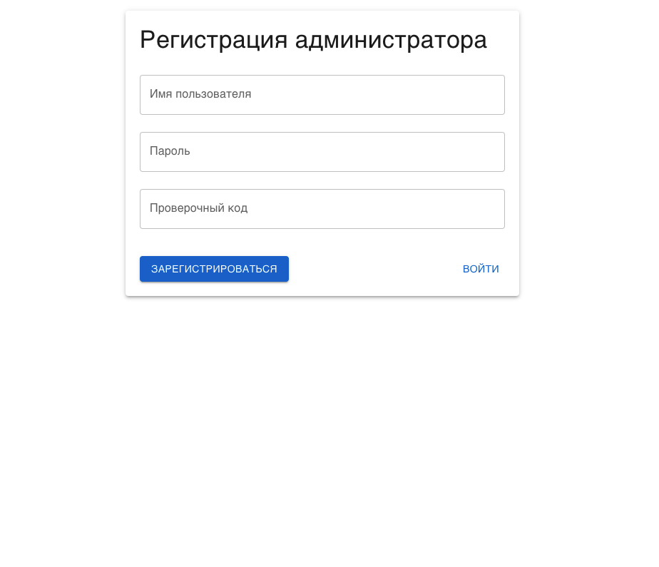
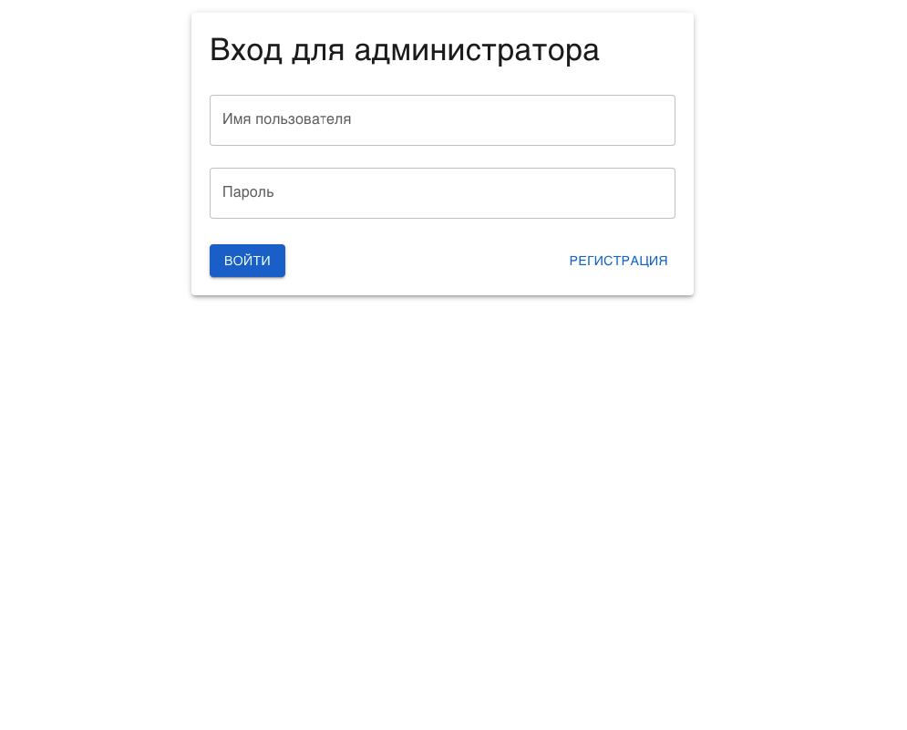
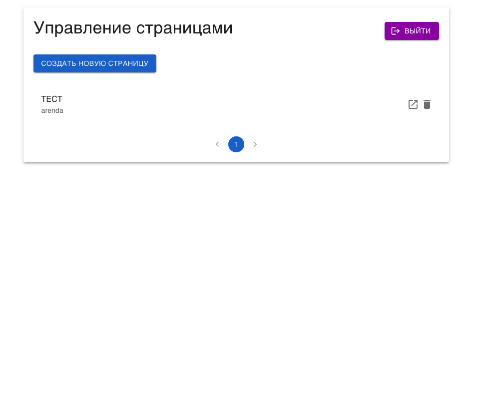
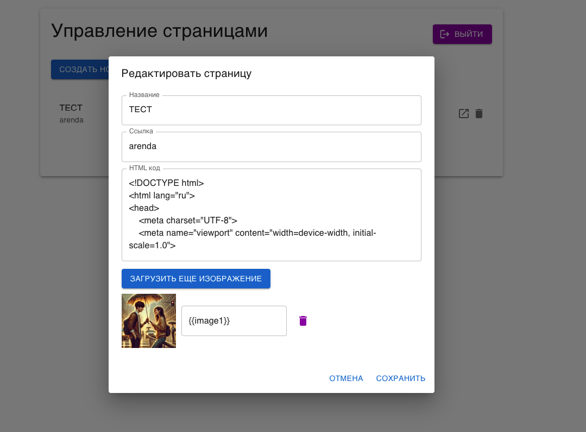
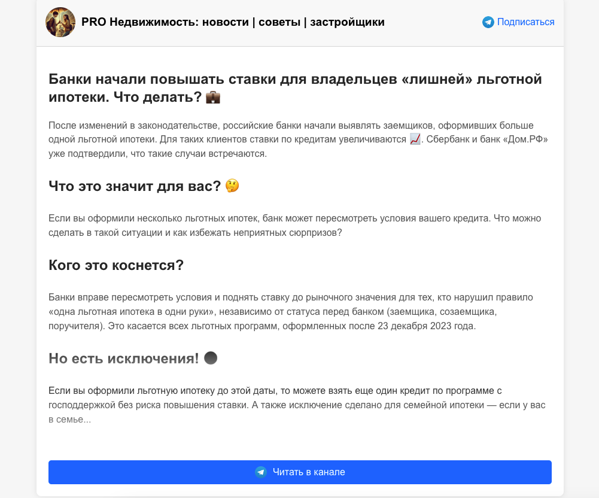

# React Admin Panel with Authentication

This project is an admin panel built with React, Material-UI, and MongoDB. It includes authentication for admins, CRUD operations for managing pages, and image uploads. Below is a step-by-step guide on how to use and navigate through the admin panel.

## Features

- **Admin Authentication:** Admins can log in and register with a secret code.
- **Page Management:** Create, edit, and delete pages with HTML content and images.
- **Pagination:** View pages with pagination (10 pages per view).
- **Image Upload:** Upload images and reference them within the HTML content.
- **Logout:** Admins can securely log out of the system.

## Prerequisites

Before starting, make sure you have the following installed:

- [Node.js](https://nodejs.org/) (v14+)
- [Docker](https://www.docker.com/)
- [MongoDB](https://www.mongodb.com/)

## Installation

### Clone the Repository

```bash
git clone https://github.com/yourusername/your-repo.git
cd your-repo
```

### Install Dependencies

```bash
npm install
```

### Set Up Environment Variables

Create a `.env` file in the root of your project and add the following variables:

can install my server https://github.com/Denisphuket/page-generator-server

```
REACT_APP_API_URL=
```

### Run the Application

To start the application locally, use:

```bash
npm start
```

## Usage

### 1. Registration & Login

When you first launch the admin panel, you'll be greeted with the registration screen. Here, you can create a new admin account using a secret code.



If you already have an account, switch to the login screen.



### 2. Admin Panel

After successful login, you'll be directed to the admin panel where you can manage pages. This includes creating new pages, editing existing ones, and deleting pages.



### 3. Page Management

#### Creating a New Page

To create a new page, click on the "Create New Page" button.



#### Editing an Existing Page

Click the edit icon next to any page to modify its content. The editor allows you to change the title, path, HTML content, and manage images.



### 4. Preview & Link

Next to the edit icon, there is an icon to view the page. This allows you to directly view how the page looks on the front end.

### 5. Pagination

The admin panel supports pagination, showing 10 pages per view. Navigate through pages using the pagination control at the bottom.

### 6. Logout

You can securely log out of the admin panel by clicking the "Logout" button on the top-right corner of the admin panel.

---

## License

This project is licensed under the MIT License - see the [LICENSE](LICENSE) file for details.

---

## Contact

If you have any questions or feedback, feel free to reach out:

- **GitHub:** [Denisphuket](https://github.com/Denisphuket)

---

**Happy Coding!**

## Available Scripts

In the project directory, you can run:

### `npm start`

Runs the app in the development mode.\
Open [http://localhost:3000](http://localhost:3000) to view it in the browser.

The page will reload if you make edits.\
You will also see any lint errors in the console.

### `npm test`

Launches the test runner in the interactive watch mode.\
See the section about [running tests](https://facebook.github.io/create-react-app/docs/running-tests) for more information.

### `npm run build`

Builds the app for production to the `build` folder.\
It correctly bundles React in production mode and optimizes the build for the best performance.

The build is minified and the filenames include the hashes.\
Your app is ready to be deployed!

See the section about [deployment](https://facebook.github.io/create-react-app/docs/deployment) for more information.

### `npm run eject`

**Note: this is a one-way operation. Once you `eject`, you can’t go back!**

If you aren’t satisfied with the build tool and configuration choices, you can `eject` at any time. This command will remove the single build dependency from your project.

Instead, it will copy all the configuration files and the transitive dependencies (webpack, Babel, ESLint, etc) right into your project so you have full control over them. All of the commands except `eject` will still work, but they will point to the copied scripts so you can tweak them. At this point you’re on your own.

You don’t have to ever use `eject`. The curated feature set is suitable for small and middle deployments, and you shouldn’t feel obligated to use this feature. However we understand that this tool wouldn’t be useful if you couldn’t customize it when you are ready for it.

## Learn More

You can learn more in the [Create React App documentation](https://facebook.github.io/create-react-app/docs/getting-started).

To learn React, check out the [React documentation](https://reactjs.org/).
